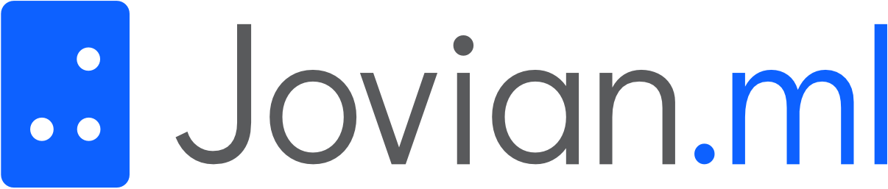

########################################################
Jovian: The platform for all your Data Science projects
########################################################

    ..

.. meta::
   :description lang=en: Automate building, versioning, and hosting of your technical documentation continuously on Read the Docs.

jovian is an open-source Python package integrated with 
|Jovian| to provide the tools necessary for Data Scientists
and ML/DL Engineers to **Track**, **Collaborate** and **Automate** projects
where even Students and Enthusiasts can leverage the same and also use 
|Jovian| to **Share** and **Showcase** their projects.

.. |Jovian| raw:: html
  
  <a href="https://jovian.ml/?utm_source=docs" target="_blank"> Jovian.ml </a>

.. toctree::
  Home <self>
  :hidden:

.. toctree::
  :caption: Getting Started

  user-guide/01-install
  user-guide/02-upload
  user-guide/03-reproduce
  user-guide/04-version
  user-guide/05-attach
  user-guide/06-track
  user-guide/07-compare
  user-guide/08-collaborate
  user-guide/09-integrations
  user-guide/10-embed
  user-guide/11-pro

.. toctree::
  :caption: API Reference
  :hidden:

  jvn/commit
  jvn/logger
  jvn/notif
  jvn/cli
  callbacks/fastai
  callbacks/keras
  jvn/oembed

.. toctree::
  :caption: Integrations
  :hidden:

  integrations/nbext
  integrations/slack
  integrations/pycharm
  integrations/vscode
  integrations/github
  integrations/telegram
  integrations/keras
  integrations/fastai
  integrations/tensorflow
  integrations/pytorch
  integrations/sklearn
  integrations/xgboost
  integrations/scipy
  integrations/opencv
  integrations/spark
  integrations/conda
  
